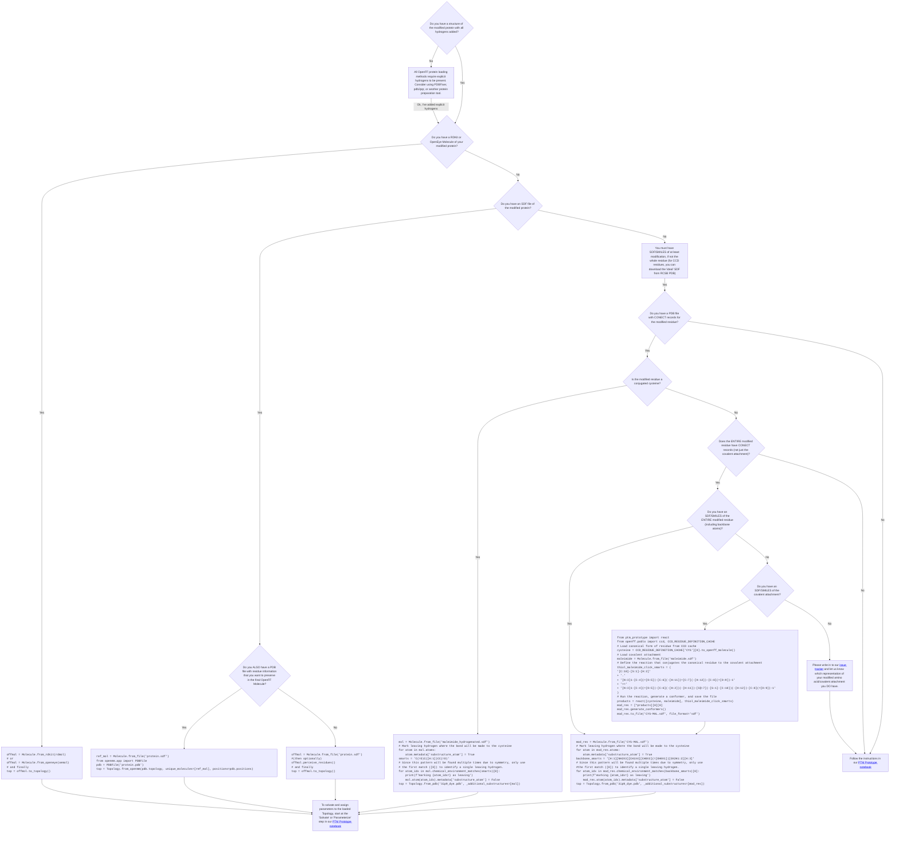

# OpenFF's PTM Parameterization Prototype!

## Short description

Run this notebook to see how to parameterize proteins with PTMs using OpenFF. Then try simulating your own modified protein, and write in to this repo's issue tracker to let us know how we can make it easier for your use cases (in particular, how we can help you define `ResidueTemplates` more easily using your inputs).

## To run

```shell
git clone https://github.com/openforcefield/ptm_prototype.git
cd ptm_prototype
micromamba create -n openff_ptm_prototype -c conda-forge -f env.yaml
micromamba run -n openff_ptm_prototype jupyter lab ptm_sim.ipynb
```

## Long description

With the alpha release of "Rosemary", our upcoming protein+small molecule force field that will handle PTMs natively, we wanted to demonstrate the _infrastructure_ to do PTM parameterization now, so it will be ready on the day the final Rosemary force field is released. This notebook shows how to parameterize and simulate a modified protein using the Rosemary alpha for both canonical and noncanonical amino acids.

The notebook also demonstrates two important upcoming features that we intend to support long-term:

* [`openff-pablo`](https://github.com/openforcefield/openff-pablo): Our new, performant PDB loader that will eventually get merged into [`Topology.from_pdb`](https://docs.openforcefield.org/projects/toolkit/en/stable/users/pdb_cookbook/index.html). Currently only handles PDB files, but will handle PDBx/mmCIF in the future.
* NAGL charges: A SMIRNOFF force field using partial charges from a NAGL model assigns partial charges so quickly that the entire non-canonical protein can be charged with a consistent charge model - no library charges in sight. 

## What's in the notebook?

The `ptm_sim.ipynb` notebook in this repo shows an example of using these new features to parameterize a modified protein. As a brief overview, it:

* Constructs an [openff-pablo]([url](https://github.com/openforcefield/openff-pablo/)) `ResidueDefinition` for the modified amino acid (this is the hard part, please write into this repo's issue tracker to let us know how we can improve this).
    * In this case, we use the `ResidueDefinition.from_molecule` method, by making an OpenFF Molecule where a cysteine is attached to a covalent ligand using a SMARTS reaction.
    * You don't have to do it exactly this way for your own custom residues - We offer [different methods](https://openff-pablo.readthedocs.io/en/latest/api/generated/openff.pablo.ResidueDefinition.html) for constructing `ResidueDefinitions` and would love your suggestions for more.
    * The atom names in this `ResidueDefinition` are required to match those used for the modified residue in the input PDB.
    * If your input PDB has CONECT records for all nonstandard residues, you don't need to use openff-pablo, and can instead use the `_additional_substructures` and `_custom_substructures` arguments to `Topology.from_pdb` (this is a bit slower since it has to do graph matching, but it doesn't require you to match up atom/residue names between the PDB and substructure)
* Solvates the modified protein in a water box
* Uses the Rosemary alpha force field to assign parameters to both canonical and non-canonical amino acids. 
* Runs a short simulation

## How can I load a modified protein?

<!--TODO: Simplify this flowchart, using only Pablo for loading-->


